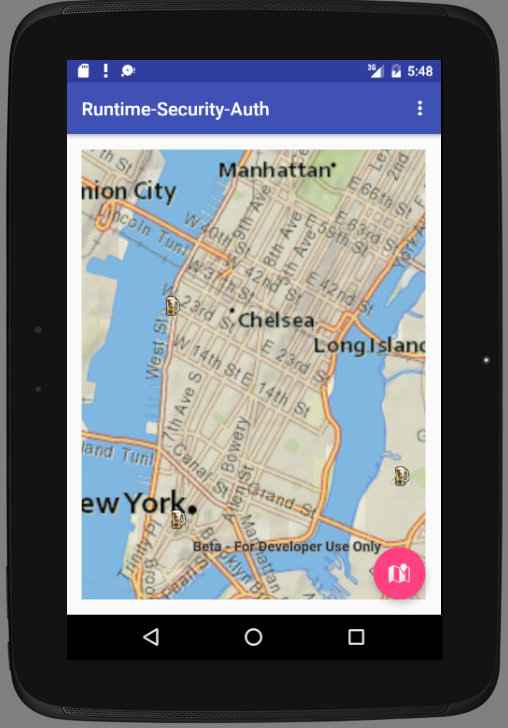

# Android-QuartzSecurity
An Android app demonstrating how to use Quartz runtime security services.

There is an accompanying MS Word document that explains everything. It will be converted to MD/HTML once the project is ready.

## Features
 - Login a user
 - Get a list of the basemaps available to the organization of the logged in user
 - Allow changing the basemap
 - Load and display a feature service from that organization (2,000 breweries in the US)
 - Display popup info of a selected feature
 - Route to selected feature from current location (requires a user logged in)

## Follow up issues with Android team
1. If using the load a portal constructor as a user login facility and then `loadStatus = arcgisPortal.getLoadStatus(); if (loadStatus != LoadStatus.LOADED)` how do we determine the cause of the login failure?

## Instructions

1. Fork and then clone the repo. 
2. [Install the SDK](https://developers.arcgis.com/android/beta/guide/install-and-set-up.htm)
3. Edit MainActivity.java and set the configuration variables to match your project definition.

## Requirements

* [System requirements](https://developers.arcgis.com/android/beta/guide/system-requirements.htm)
* Basic knowledge of Android Java software development and practice. 
* Basic understanding of key ArcGIS Features.
* Set up a developer account on Developers.arcgis.com.
* Set up an Application on Developers.arcgis.com.

## Resources

* [ArcGIS Runtime SDK for Android](http://developers.arcgis.com/android/beta/index.html)
* [twitter@geoplay9](http://twitter.com/geoplay9)

## Issues

Find a bug or want to request a new feature?  Please let us know by submitting an issue in this repo.

## Contributing

Esri welcomes contributions from anyone and everyone. Please see our [guidelines for contributing](https://github.com/esri/contributing).

## Licensing
Copyright 2016 Esri

Licensed under the Apache License, Version 2.0 (the "License");
you may not use this file except in compliance with the License.
You may obtain a copy of the License at

   http://www.apache.org/licenses/LICENSE-2.0

Unless required by applicable law or agreed to in writing, software
distributed under the License is distributed on an "AS IS" BASIS,
WITHOUT WARRANTIES OR CONDITIONS OF ANY KIND, either express or implied.
See the License for the specific language governing permissions and
limitations under the License.

A copy of the license is available in the repository's [license.txt](license.txt) file.

​
